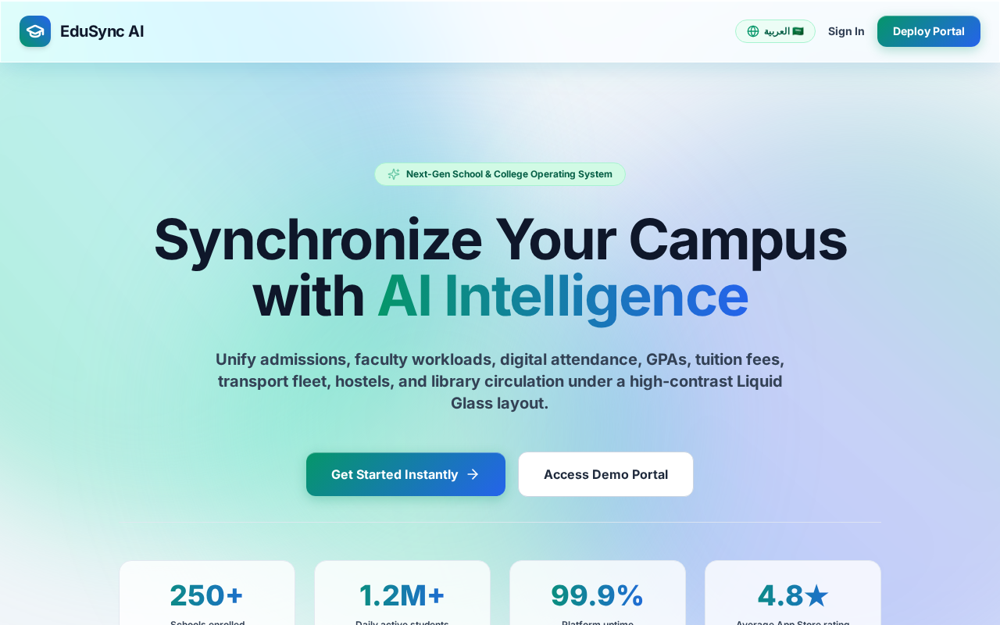
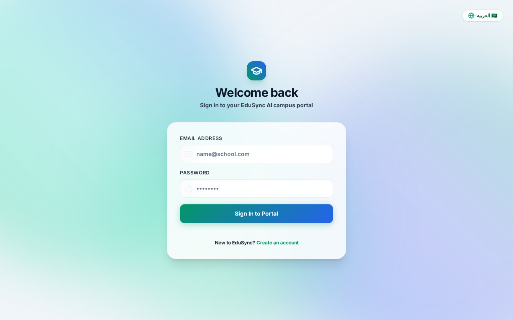
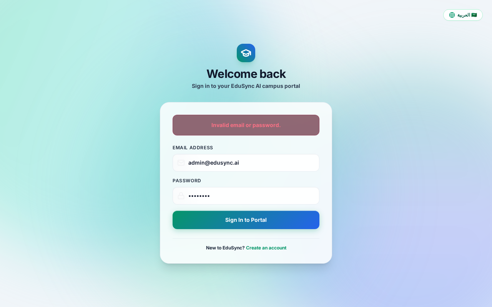

# 🎓 EduSync AI - Enterprise School & College Management System
## Official User Manual, Operational Guide & GUI Walkthrough
**Version 3.2.0**

---

## 📌 Table of Contents & Quick Navigation Links
1. [Introduction & System Overview](#1-introduction--system-overview)
2. [Getting Started & Installation](#2-getting-started--installation)
3. [User Roles & Access Control](#3-user-roles--access-control)
4. [GUI Interfaces & Core Navigation](#4-gui-interfaces--core-navigation)
   - [4.1 Institutional Public Landing Page](#41-institutional-public-landing-page)
   - [4.2 Unified Authentication Portal](#42-unified-authentication-portal)
   - [4.3 Administrator & Leadership Executive Dashboard](#43-administrator--leadership-executive-dashboard)
   - [4.4 Principal & Leadership Portal](#44-principal--leadership-portal)
   - [4.5 Department Head (HOD) Portal](#45-department-head-hod-portal)
   - [4.6 Teacher & Faculty Portal](#46-teacher--faculty-portal)
   - [4.7 Student Portal & AI Tutor](#47-student-portal--ai-tutor)
   - [4.8 Parent & Guardian Portal](#48-parent--guardian-portal)
   - [4.9 Accountant & Financial Desk](#49-accountant--financial-desk)
5. [Comprehensive Module Operational Manual](#5-comprehensive-module-operational-manual)
   - [Module 1: Student Information Management System (SIMS)](#module-1-student-information-management-system-sims)
   - [Module 2: Faculty Information Management System (FIMS)](#module-2-faculty-information-management-system-fims)
   - [Module 3: Academic Scheduling & Timetable Engine](#module-3-academic-scheduling--timetable-engine)
   - [Module 4: Digital Attendance Register](#module-4-digital-attendance-register)
   - [Module 5: Examinations, Grading & GPA Calculator](#module-5-examinations-grading--gpa-calculator)
   - [Module 6: Assignments & Digital Submissions](#module-6-assignments--digital-submissions)
   - [Module 7: Finance, Tuition Fees & Invoicing (INR ₹)](#module-7-finance-tuition-fees--invoicing-inr-)
   - [Module 8: EduSync AI Tutor & At-Risk Predictive Analytics](#module-8-edusync-ai-tutor--at-risk-predictive-analytics)
   - [Module 9: SOP Policy Guidelines & Arabic RTL Support](#module-9-sop-policy-guidelines--arabic-rtl-support)
   - [Module 10: Transport Fleet & Bus Route Engine](#module-10-transport-fleet--bus-route-engine)
   - [Module 11: Hostel & Dormitory Accommodation System](#module-11-hostel--dormitory-accommodation-system)
   - [Module 12: Library Management System (LMS)](#module-12-library-management-system-lms)
6. [Pricing Tiers & Subscription Management](#6-pricing-tiers--subscription-management)
7. [Troubleshooting & Frequently Asked Questions (FAQ)](#7-troubleshooting--frequently-asked-questions-faq)

---

## 1. Introduction & System Overview

**EduSync AI** is a next-generation Cloud ERP and Academic Operating System designed for K-12 schools, high school academies, vocational colleges, and university networks. Built with a high-performance **Liquid Glass** user interface, EduSync AI unifies all administrative, academic, financial, and facility management operations under a single platform.

[↩ Back to Table of Contents](#-table-of-contents--quick-navigation-links)

### Key Differentiators
- **Dual-Engine Architecture:** High availability PostgreSQL backend with automatic in-memory fallback ensure uninterrupted operational uptime.
- **Generative AI Integration:** Native integration with Google Gemini 1.5 Flash powers an interactive AI Student Tutor, automated academic at-risk predictions, and 1-click English-to-Arabic SOP translation.
- **Bilingual & RTL Ready:** Instant dynamic switching between English and Arabic (`dir="rtl"`) for guidelines, forms, timelines, and interface components.
- **Multi-Tenant & Multi-Role:** Standardized role-based access for 7 distinct campus personas across dedicated web portals.
- **Native INR (₹) Financial Management:** Enterprise pricing tiers, fee invoice generation, payment transaction tracking, and printable PDF voucher receipts in Indian Rupees (₹).

---

## 2. Getting Started & Installation

[↩ Back to Table of Contents](#-table-of-contents--quick-navigation-links)

### System Prerequisites
- **Node.js:** v18.0.0 or higher
- **Package Manager:** `npm` (v9.0.0+) or `yarn`
- **Database:** PostgreSQL v14+ (Optional; fallback in-memory mode active by default)

### Installation & Launching the Application

1. **Clone the Repository:**
   ```bash
   git clone https://github.com/Masthan008/edusyncai.git
   cd "EduSync AI"
   ```

2. **Backend Setup & Launch:**
   ```bash
   cd backend
   npm install
   npm run db:seed    # Seeds default initial data and demo credentials
   npm run dev        # Launches server on http://localhost:5000
   ```

3. **Frontend Setup & Launch:**
   ```bash
   cd ../frontend
   npm install
   npm run dev        # Launches UI client on http://localhost:3000
   ```

---

## 3. User Roles & Access Control

[↩ Back to Table of Contents](#-table-of-contents--quick-navigation-links)

EduSync AI implements Role-Based Access Control (RBAC) to ensure security and privacy across all institution operations.

| Role | Access Level | Primary Responsibilities | Direct Section Link |
| :--- | :--- | :--- | :--- |
| **Admin** | System Wide | System configuration, database backups, pricing tier management, global user accounts | [Admin Manual](#43-administrator--leadership-executive-dashboard) |
| **Principal** | Academic Executive | Institution oversight, SOP policy approval, staff/student analytics, curriculum monitoring | [Principal Manual](#44-principal--leadership-portal) |
| **HOD** | Department Head | Departmental schedules, course allocations, teacher evaluations, subject performance | [HOD Manual](#45-department-head-hod-portal) |
| **Teacher** | Classroom Level | Attendance check-ins, assignment creation, exam grading, student AI performance notes | [Teacher Manual](#46-teacher--faculty-portal) |
| **Student** | Personal Portal | Viewing timetables, submitting assignments, AI Tutor assistance, checking grades & attendance | [Student Manual](#47-student-portal--ai-tutor) |
| **Parent** | Ward Guardian | Monitoring student progress, attendance alerts, fee invoice payment & receipt downloads | [Parent Manual](#48-parent--guardian-portal) |
| **Accountant** | Financial Desk | Processing tuition fees, generating transaction ledger reports, managing pending balances | [Accountant Manual](#49-accountant--financial-desk) |

---

## 4. GUI Interfaces & Core Navigation

### 4.1 Institutional Public Landing Page


- **GUI Overview:** The public landing page features a modern Liquid Glass aesthetics with translucent frosted panels, live pricing tiers in Indian Rupees (₹), enterprise feature feature highlights, and direct sign-in entry points.
- **Key Navigation Points:**
  - **Header Bar:** Quick links to Pricing Tiers, PRD Documentation, and Language Switcher (English / العربية).
  - **Call to Action (CTA):** "Explore Portal" button redirects directly to the portal login screen.

[↩ Back to Table of Contents](#-table-of-contents--quick-navigation-links)

---

### 4.2 Unified Authentication Portal


- **GUI Overview:** Translucent glassmorphism login card centered on dynamic liquid blob animated backgrounds. Supports single sign-on authentication across all 7 user personas.
- **Default Credentials for Testing:**
  - **Admin:** `admin@edusync.com` / `admin123`
  - **Principal:** `principal@edusync.com` / `admin123`
  - **Teacher:** `teacher@edusync.com` / `admin123`
  - **Student:** `student@edusync.com` / `admin123`
  - **Parent:** `parent@edusync.com` / `admin123`
  - **Accountant:** `accountant@edusync.com` / `admin123`

[↩ Back to Table of Contents](#-table-of-contents--quick-navigation-links)

---

### 4.3 Administrator & Leadership Executive Dashboard


- **GUI Overview:** Real-time KPI summary dashboard displaying active student enrollment, total faculty count, pending tuition collections (₹), and system health metrics.
- **Key Navigation Points:**
  - **Sidebar Menu:** Access to [SIMS (Students)](#module-1-student-information-management-system-sims), [FIMS (Teachers)](#module-2-faculty-information-management-system-fims), [Attendance](#module-4-digital-attendance-register), [Grading](#module-5-examinations-grading--gpa-calculator), [Finance](#module-7-finance-tuition-fees--invoicing-inr-), [AI Tutor](#module-8-edusync-ai-tutor--at-risk-predictive-analytics), and [SOP Guidelines](#module-9-sop-policy-guidelines--arabic-rtl-support).
  - **Bilingual Switcher:** Top-right language toggle converts interface instantly into Arabic Right-to-Left (RTL) layout.

[↩ Back to Table of Contents](#-table-of-contents--quick-navigation-links)

---

### 4.4 Principal & Leadership Portal
- **GUI Overview:** Provides academic institution oversight, performance heatmaps, teacher activity logs, and at-risk student monitoring.
- **Key Actions:** Approve institution SOPs, view multi-department pass rates, and trigger institutional reporting.

[↩ Back to Table of Contents](#-table-of-contents--quick-navigation-links)

---

### 4.5 Department Head (HOD) Portal
- **GUI Overview:** Dedicated portal for managing course allocations, faculty timetables, and subject-wise grade distributions.
- **Key Actions:** Review subject exam results, assign period schedules, and review departmental guidelines.

[↩ Back to Table of Contents](#-table-of-contents--quick-navigation-links)

---

### 4.6 Teacher & Faculty Portal
- **GUI Overview:** Classroom-centric view allowing teachers to take digital attendance registers, publish homework assignments, and log test marks.
- **Key Actions:** Record daily attendance, input student exam scores, and check subject timetable grids.

[↩ Back to Table of Contents](#-table-of-contents--quick-navigation-links)

---

### 4.7 Student Portal & AI Tutor
- **GUI Overview:** Student workspace showing class schedules, attendance percentage, active GPA, assignment submission dropzones, and the Google Gemini 1.5 Flash AI Tutor chatbot.
- **Key Actions:** Chat with AI Tutor for homework help, submit assignment PDFs, and track transcript GPA.

[↩ Back to Table of Contents](#-table-of-contents--quick-navigation-links)

---

### 4.8 Parent & Guardian Portal
- **GUI Overview:** Transparent portal for guardians to monitor their ward's academic standing, attendance alerts, fee invoices, and download official payment receipts.
- **Key Actions:** Pay tuition fees in INR (₹), download PDF receipts, and communicate with class teachers.

[↩ Back to Table of Contents](#-table-of-contents--quick-navigation-links)

---

### 4.9 Accountant & Financial Desk
- **GUI Overview:** Financial management suite displaying total collected revenue, pending tuition dues, monthly collection graphs, and invoice generator tools.
- **Key Actions:** Issue student fee invoices, record manual payments, and export transaction ledgers.

[↩ Back to Table of Contents](#-table-of-contents--quick-navigation-links)

---

## 5. Comprehensive Module Operational Manual

### Module 1: Student Information Management System (SIMS)
- **Overview:** Central database for student profiles, admission records, and parent linkages.
- **Operational Steps:**
  1. Go to **Students** section in the sidebar.
  2. Click **Admit Student**, fill in mandatory fields (Full Name, Roll Number, Class/Section, Guardian Details).
  3. Click **Save Student**. Profile becomes immediately active across attendance and grading rosters.

[↩ Back to Table of Contents](#-table-of-contents--quick-navigation-links)

---

### Module 2: Faculty Information Management System (FIMS)
- **Overview:** Directory of teaching staff, qualifications, assigned departments, and course schedules.
- **Operational Steps:**
  1. Open **Faculty / Staff** menu.
  2. Click **Register Faculty**, assign Department (e.g. Science, Humanities) and subject expertise.
  3. View active teaching workloads and assign HOD roles.

[↩ Back to Table of Contents](#-table-of-contents--quick-navigation-links)

---

### Module 3: Academic Scheduling & Timetable Engine
- **Overview:** Conflict-free timetable engine for classes, teachers, and rooms.
- **Operational Steps:**
  1. Select **Timetables** from the HOD/Admin sidebar.
  2. Pick Class Section and Day of week.
  3. Assign Period Slot, Subject, Teacher, and Room. System blocks duplicate teacher/room assignments automatically.

[↩ Back to Table of Contents](#-table-of-contents--quick-navigation-links)

---

### Module 4: Digital Attendance Register
- **Overview:** Daily and subject-wise attendance register with automated guardian alert triggers.
- **Operational Steps:**
  1. Teachers open **Attendance Register**.
  2. Select Class, Section, and Subject.
  3. Toggle student status (**Present**, **Absent**, **Late**) and click **Submit Register**.

[↩ Back to Table of Contents](#-table-of-contents--quick-navigation-links)

---

### Module 5: Examinations, Grading & GPA Calculator
- **Overview:** Exam score logging with automated letter grade and 4.0 GPA scale conversion.
- **Operational Steps:**
  1. Open **Exams & Grading**.
  2. Select Term (e.g., Mid-Term 2025) and Subject.
  3. Enter student marks. System calculates percentage, Letter Grade, and GPA points automatically.

[↩ Back to Table of Contents](#-table-of-contents--quick-navigation-links)

---

### Module 6: Assignments & Digital Submissions
- **Overview:** Digital homework distribution and student file upload portal.
- **Operational Steps:**
  1. Teacher creates assignment with title, description, and due date.
  2. Student opens assignment card, attaches document, and clicks **Turn In**.
  3. Teacher reviews submission, enters score, and posts feedback.

[↩ Back to Table of Contents](#-table-of-contents--quick-navigation-links)

---

### Module 7: Finance, Tuition Fees & Invoicing (INR ₹)
- **Overview:** Multi-channel fee collection, invoice dispatch, and printable receipt vouchers in INR (₹).
- **Operational Steps:**
  1. Accountant generates itemized invoice in INR (₹).
  2. Parent logs into portal and executes fee payment.
  3. Click **Download Receipt** to print formatted PDF receipt voucher.

[↩ Back to Table of Contents](#-table-of-contents--quick-navigation-links)

---

### Module 8: EduSync AI Tutor & At-Risk Predictive Analytics
- **Overview:** Generative AI chatbot powered by Google Gemini 1.5 Flash and predictive student academic risk analytics.
- **Operational Steps:**
  1. Students open **EduSync AI Chat** for study aid, practice questions, and explanation.
  2. Principals view **At-Risk Analytics** tab to identify students requiring academic intervention.

[↩ Back to Table of Contents](#-table-of-contents--quick-navigation-links)

---

### Module 9: SOP Policy Guidelines & Arabic RTL Support
- **Overview:** Institutional policy hub featuring 1-click AI translation into Arabic and native Right-to-Left (RTL) interface rendering.
- **Operational Steps:**
  1. Open **Policy & SOP Guidelines**.
  2. Click **Translate to Arabic (العربية)** for instantaneous Gemini AI translation.
  3. Click the top navbar language toggle to switch full UI to Arabic (`dir="rtl"`).

[↩ Back to Table of Contents](#-table-of-contents--quick-navigation-links)

---

### Module 10: Transport Fleet & Bus Route Engine
- **Overview:** Vehicle records, bus driver contact details, pickup routes, and monthly transport fee billing.
- **Operational Steps:**
  1. Open **Transport Fleet**.
  2. Register vehicle details, define route stops, and assign monthly route fare in INR (₹).
  3. Link students to specific bus routes.

[↩ Back to Table of Contents](#-table-of-contents--quick-navigation-links)

---

### Module 11: Hostel & Dormitory Accommodation System
- **Overview:** Dormitory room management, bed allocations, and room rent billing.
- **Operational Steps:**
  1. Open **Hostel Management**.
  2. Configure hostel blocks and room types (Single, Double, AC).
  3. Allocate students to vacant rooms and monitor occupancy.

[↩ Back to Table of Contents](#-table-of-contents--quick-navigation-links)

---

### Module 12: Library Management System (LMS)
- **Overview:** Book cataloging, ISBN barcode tracking, issue/return transactions, and fine calculation.
- **Operational Steps:**
  1. Open **Library LMS**.
  2. Add book title, author, and ISBN number.
  3. Process book checkouts and returns against student roll numbers.

[↩ Back to Table of Contents](#-table-of-contents--quick-navigation-links)

---

## 6. Pricing Tiers & Subscription Management

[↩ Back to Table of Contents](#-table-of-contents--quick-navigation-links)

EduSync AI offers flexible tier subscription models catered to different institutional sizes with native Indian Rupee (INR ₹) pricing:

| Plan Tier | Monthly Price | Target Institution | Included Capabilities |
| :--- | :---: | :--- | :--- |
| **Academy Starter** | **₹9,999** / mo | K-12 Private Schools, Coaching Academies | Up to 500 Students, SIMS, FIMS, Attendance, Exams, Invoicing |
| **Campus Enterprise** | **₹24,999** / mo | Colleges, High Schools, Multi-Branch | Unlimited Students, Gemini AI Tutor, At-Risk Analytics, Arabic RTL SOPs, Transport, Hostel, Library LMS |
| **District SaaS Network** | **₹49,999** / mo | University Networks, Education Boards | Multi-tenant isolation, Custom Domain, SSO/SAML, On-Premises Docker Deployment, SLA Support |

*Administrators can update pricing tier details directly through the Admin Dashboard under `/api/school/pricing`.*

---

## 7. Troubleshooting & Frequently Asked Questions (FAQ)

[↩ Back to Table of Contents](#-table-of-contents--quick-navigation-links)

### Q1: What happens if the primary PostgreSQL database disconnects?
**Answer:** EduSync AI features an integrated **In-Memory Fallback Engine**. In the event of PostgreSQL database maintenance or connection drop, the system automatically switches to in-memory mode, ensuring continuous operational availability without crashing or showing error pages.

### Q2: How does the AI translation for SOP guidelines work?
**Answer:** The SOP module sends the guideline document to the Google Gemini 1.5 Flash API endpoint. If external API access is restricted, local fallback translation engines automatically deliver standard Arabic translations.

### Q3: How do parents download payment receipts?
**Answer:** Parents can log into the Parent Portal, navigate to **Fees & Payments**, select any invoice marked **PAID**, and click **Download Receipt**. A formatted PDF receipt with transaction ID and breakdown will be downloaded.

### Q4: Can teachers change grades after publishing them?
**Answer:** Grades can be updated by the subject teacher or Department Head (HOD) prior to final term lock. Any modification made after lock requires approval from the Principal account.

---

*EduSync AI System Manual — Confidential & Proprietary — EduSync AI Systems Inc.*
