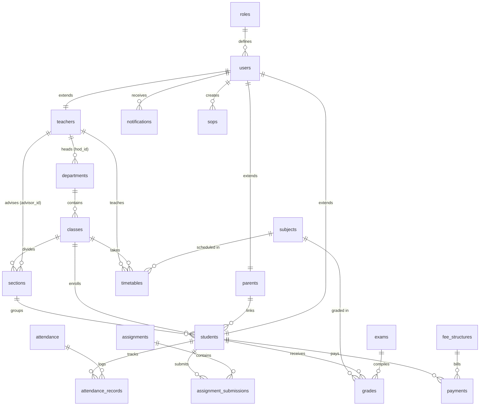

# Product Requirements Document (PRD): EduSync AI

## 1. Document Overview
* **Project Name:** EduSync AI
* **Document Type:** Product Requirements Document (PRD)
* **Version:** 1.0
* **Target Audience:** Engineering, Product Operations, School Administrators
* **Design Philosophy:** Premium Light Glassmorphism ("Liquid Glass" theme) with integrated AI features.

---

## 2. Executive Summary
EduSync AI is a modern, responsive, AI-powered School Management ERP system designed to unify educational operations, academic grading, classroom schedules, payment structures, and school guidelines. It replaces traditional, fragmented admin systems with a unified digital ecosystem that provides tailor-made workspaces for seven campus personas: **Admins, Principals, HODs, Teachers, Students, Parents, and Accountants**. 

By leveraging generative AI (Google Gemini 1.5 Flash), the platform provides automated report card summaries, performance risk analyses, multilingual Standard Operating Procedures (SOPs) with one-click translations, and an interactive academic chatbot tutor.

---

## 3. Product Goals
1. **Unified Workspace:** Replace redundant physical paperwork and disparate databases with a single, role-based dashboard.
2. **AI-Assisted Academics:** Empower students with direct tutoring and help administrators perform early intervention for at-risk students using automated grading and attendance trends.
3. **Global Accessibility:** Offer full Right-to-Left (RTL) Layout and high-quality translations for Arabic-speaking parents and faculty.
4. **Premium User Experience:** Elevate standard SaaS designs to a high-end interface featuring glossy glass elements, transparent blurred backdrops, and floating fluid blobs.

---

## 4. User Roles & Portal Personas
The system splits permissions and views based on seven core security roles, served through five customized React dashboard interfaces:

### A. Administrator (Admin Dashboard)
* **Scope:** Universal system settings, campus directories, and SOP control.
* **Core Capabilities:**
  * Manage Student, Faculty, and Parent directories (Create, Edit, Deactivate).
  * Configure Departments and allocate Heads of Departments (HOD).
  * Structure Classes and Section dividers (with assigned advisor teachers and classrooms).
  * Manage standard fee schedules (tuition templates).
  * Create, edit, and auto-translate Standard Operating Procedures (SOPs).

### B. Principal & HOD (Admin/Staff Portal Overlay)
* **Scope:** Departmental workloads and performance assessments.
* **Core Capabilities:**
  * Review allocated teaching timetables and class schedules.
  * Audit student GPAs, grade distributions, and attendance logs.
  * Monitor department budgets and student performance metrics.

### C. Teacher (Teacher Dashboard)
* **Scope:** Classroom instruction management and progress tracking.
* **Core Capabilities:**
  * Record daily student attendance (Present, Absent, Late, Excused) with text remarks.
  * Define and assign homework assignments with custom due dates and point thresholds.
  * Grade submitted homework and provide text remarks.
  * View assigned schedule timetables.
  * View SOP guidelines in English or Arabic.

### D. Student (Student Dashboard)
* **Scope:** Personal academics and interactive learning.
* **Core Capabilities:**
  * View personal GPA charts and overall letter grade logs.
  * Upload PDF file submissions for assignments.
  * Check daily/weekly timetable calendars.
  * Interact with the **EduSync AI Chatbot Tutor** for homework assistance.
  * Read campus SOP guidelines.

### E. Parent (Parent Dashboard)
* **Scope:** Student progress monitoring and campus billing.
* **Core Capabilities:**
  * Track children's report cards and GPAs.
  * Review attendance records.
  * View outstanding invoices and pay tuition bills (Bank Transfer, Card, Cash, etc.).
  * Access Arabic translated SOP guidelines.

### F. Accountant (Accountant Dashboard)
* **Scope:** Fee structuring and billing ledger.
* **Core Capabilities:**
  * Setup annual tuition fees matching class categories.
  * Review student invoice ledgers.
  * Register manual transaction payments and verify references.

---

## 5. Functional Requirements & Key Features

### Feature 1: Core Academic & Scheduling Engine
* **Department Routing:** Create departments with unique codes and link to faculty advisors.
* **Section Allocation:** Classes are divided into sections with maximum seats, advisory teachers, and designated room numbers.
* **Conflict-Free Timetables:** Assign teachers, classes, sections, and subjects to time blocks. The database enforces uniqueness on `(class_id, section_id, day_of_week, start_time)` to avoid scheduling conflicts.

### Feature 2: Digital Attendance Register
* **Session Logs:** Teachers log attendance by class, section, and subject date.
* **Standard Statuses:** Valid values include `Present`, `Absent`, `Late`, and `Excused`.
* **RTL Calendar:** Attendance trackers align cleanly in right-to-left grids when viewed in Arabic mode.

### Feature 3: Gradebook & Assignments Portal
* **Homework Submissions:** Students submit files via URLs (e.g. cloud documents or PDFs) before deadlines.
* **Automatic Grading Integrity:** The system validates that `marks_obtained` cannot exceed `max_marks` and tracks grader IDs.
* **GPA Calculator:** Automatically translates numerical grades into letter grades (e.g., A+, B, F) and grade points (e.g. 4.00) based on standard academic configurations.

### Feature 4: Billing Ledger & Payments Tracking
* **Fee Structure Template:** Set class-specific invoices (e.g. Grade 10 annual tuition fee) for an academic year.
* **Multi-channel Payments:** Track payment references with standard channels: `Card`, `Cash`, `BankTransfer`, and `ChequeDD`.
* **Transaction Lifecycle:** Payments track standard states: `Paid`, `Pending`, `Failed`.

### Feature 5: AI-Assisted Academic Engine (Google Gemini Integration)
* **Academic Assistant Chatbot:** A student chatbot tutor. Reads personal student profiles (name, class, section, grades context) to provide tailored educational help.
* **Automated Performance Insights:** Evaluates grade averages and absence metrics to return standard JSON data containing:
  * Performance Trend (`improving`, `stable`, `critical`)
  * Risk Level (`low`, `medium`, `high`)
  * Student Strengths (bulleted arrays)
  * Study Recommendations (action items)
* **Report Card Summaries:** Synthesizes exam marks lists to output structured, clean markdown summaries of student standing, strengths, and areas for improvement.
* **Local Fallback:** Fallback logic handles template predictions offline if the Gemini API key is missing.

### Feature 6: Dynamic Standard Operating Procedures (SOP)
* **SOP Builder:** Admins publish operational guidelines split by categories.
* **Smart Translation:** One-click translate button converts English guidelines into correct Arabic.
* **Local Dictionary Fallback:** If the Gemini translation service is offline, a local dictionary translates standard campus phrases.
* **RTL Layout Transition:** The SOP viewer dynamically triggers `dir="rtl"` in Arabic mode to align timelines, scrollbars, list bullets, and texts right-to-left.

---

## 6. Technical Architecture

### Tech Stack
* **Frontend:** React, TypeScript, React Router DOM, Axios (request/response interceptors for token handling), Zustand (auth state store), Tailwind CSS, Lucide React.
* **Backend:** Node.js, Express, TypeScript, PostgreSQL (pg client), Zod validation schemas, JSON Web Tokens (session auth), Helmet (security headers), Morgan (logger).
* **AI Processing:** Direct HTTPS fetch routing to Google Generative Language API (Gemini 1.5 Flash).

### Database Model (PostgreSQL)

#### Core Database Schema Entities
1. **`roles`:** Stores role names (`Admin`, `Teacher`, `Student`, `Parent`, `Accountant`, etc.).
2. **`users`:** Stores emails, passwords, role links, and deactivation states.
3. **`academic_years`:** Tracks school calendar terms (e.g. `2025-2026`).
4. **`departments`:** Configures academic offices and links Head of Department teachers.
5. **`teachers`:** Profile data for faculty, linked to user credentials.
6. **`parents`:** Profile data for parents/guardians, linked to user credentials.
7. **`classes`:** Campus grade levels (e.g. `Grade 10`).
8. **`sections`:** Classroom divisions (e.g. `10-A`) with advisor links.
9. **`students`:** Student profile cards, linking classes, sections, roll numbers, and parents.
10. **`subjects`:** Academic course roster (e.g., Organic Chemistry).
11. **`attendance`:** Daily register headers.
12. **`attendance_records`:** Individual student check-in states (`Present`, `Absent`, `Late`, `Excused`).
13. **`exams`:** Test sessions grouped by academic years and classes.
14. **`grades`:** Exam score logs mapping subject points and automatic letter grades.
15. **`assignments`:** Tasks assigned to class sections by teachers.
16. **`assignment_submissions`:** Submissions log with attachment links, statuses, and teacher grades.
17. **`fee_structures`:** Invoices templates set per class category.
18. **`payments`:** Transaction records log details, payments methods, and transaction IDs.
19. **`timetables`:** Roster calendars map subject hours to classrooms, preventing teacher/room conflicts.
20. **`notifications`:** Alerts dispatched to specific user IDs.
21. **`sops`:** Guidelines tables, storing double-language data fields (`title`, `title_ar`, etc.).

---

## 7. Interface Aesthetics & Styling System
The interface uses a premium **Light Mode Glassmorphism & Liquid Glass** theme:
* **Frosted Glass Cards (`.glass-panel`, `.glass-panel-dark`):** Semi-transparent white containers with high backdrop-blur values (`backdrop-filter: blur(20px)`) and soft reflection borders (`rgba(255, 255, 255, 0.7)`).
* **Animated Liquid Backdrops:** Absolute-positioned, color-shifting gradient blobs that slowly float across the background canvas via keyframe animations (`float-blob`).
* **Input Elements:** Clean, highly visible white input cards (`bg-white/80`) with dark text, subtle gray placeholders, and glowing cyan borders on selection.
* **Readable Typography:** Standard Inter sans-serif typeface, styled in dark slate neutrals (`text-slate-800`, `text-slate-900`) for high contrast on the translucent glass panels.
