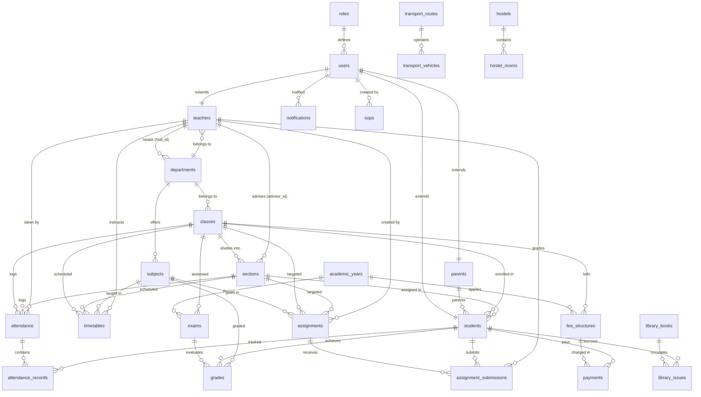

# Product Requirements Document (PRD) & Technical Master Specifications
## Project Name: EduSync AI - Enterprise School & College ERP System
* **Document Version:** 2.5 (Client & Enterprise Master Edition)
* **Status:** Approved / Client-Ready Presentation Master
* **Target Audience:** School/College Board Directors, IT Infrastructure Teams, System Architects, Software Engineers
* **Product Vision:** A next-generation, AI-driven, multi-persona Educational Resource Planning (ERP) platform unifying academics, finance, administration, transport fleet, hostels, library, policy guidelines, and student intelligence under a high-performance Liquid Glass interface.

---

## Table of Contents
1. [Executive Summary & Value Proposition](#1-executive-summary--value-proposition)
   - 1.1 Project Overview
   - 1.2 Key Differentiators for Client Pitch
   - 1.3 Pin-to-Pin Enterprise ERP Feature Comparison Matrix
2. [Platform Architecture & Technology Stack](#2-platform-architecture--technology-stack)
3. [Authentication, Security & Access Control](#3-authentication-security--access-control)
4. [Comprehensive Module Specifications (Pin-to-Pin Detail)](#4-comprehensive-module-specifications-pin-to-pin-detail)
   - Module 1: Authentication & Identity Management
   - Module 2: Institutional Infrastructure & Hierarchy
   - Module 3: Student Information Management System (SIMS)
   - Module 4: Faculty & Staff Information System (FIMS)
   - Module 5: Academic Scheduling & Timetable Engine
   - Module 6: Digital Attendance Tracking & Register
   - Module 7: Examination, Grading & GPA Analytics Engine
   - Module 8: Homework, Assignments & File Submission Portal
   - Module 9: Finance, Tuition Fees & Transaction Ledger
   - Module 10: AI Academic Assistant & Predictive Intelligence (Google Gemini)
   - Module 11: Standard Operating Procedures (SOP) & Policy Hub (Bilingual + RTL)
   - Module 12: Executive Analytics & KPI Dashboards
   - Module 13: Transport Fleet & Bus Route Management Engine
   - Module 14: Hostel & Dormitory Accommodation System
   - Module 15: Library Management System (LMS & Circulation)
5. [Detailed User Portal Specs (7 Campus Personas)](#5-detailed-user-portal-specs-7-campus-personas)
6. [Complete Database ERD & Schema Definition (27 Tables)](#6-complete-database-erd--schema-definition-27-tables)
7. [REST API Route Registry & Endpoint Map](#7-rest-api-route-registry--endpoint-map)
8. [Design System & UI Specifications ("Liquid Glass")](#8-design-system--ui-specifications-liquid-glass)
9. [Future Feature Vision & Strategic Product Roadmap](#9-future-feature-vision--strategic-product-roadmap)
10. [Deployment Models, Security & Compliance](#10-deployment-models-security--compliance)

---

## 1. Executive Summary & Value Proposition

### 1.1 Project Overview
EduSync AI is an all-in-one Cloud ERP and Academic Operating System designed for K-12 schools, high school academies, vocational colleges, and university networks. Traditional educational administrative software suffers from fragmented modules, slow user interfaces, lack of real-time parent-teacher visibility, and zero predictive insights. EduSync AI solves these challenges by combining a centralized database with real-time analytics, automated AI assistant capabilities, bilingual English/Arabic operational SOPs, and role-tailored dashboards.

### 1.2 Key Differentiators for Client Pitch
1. **Dual-Execution Engine (High Availability):** Operates seamlessly on PostgreSQL for enterprise cloud deployments, while maintaining an automatic **In-Memory Fallback Engine** so system operations never halt during server maintenance or database downtime.
2. **Built-in Generative AI (Google Gemini 1.5 Flash):** AI tutor chatbot for students, automated at-risk academic warnings, instant AI summary reports for teachers, and one-click English-to-Arabic SOP translations.
3. **Native Bilingual & RTL Support:** Instant switching between English and Arabic (`dir="rtl"`) across guidelines, forms, timelines, and navigation elements.
4. **Unified Multi-Role Access:** Single software installation serving 7 distinct roles (Admin, Principal, HOD, Teacher, Student, Parent, Accountant) across 5 specialized portal interfaces.
5. **State-of-the-Art Design Aesthetics:** "Liquid Glass" theme built with glassmorphic panels, dynamic floating gradient animations, high-contrast slate typography, and responsive mobile-first layouts.

### 1.3 Pin-to-Pin Enterprise ERP Feature Comparison Matrix

| ERP Feature Domain | PowerSchool (District ERP) | Fedena (Modular ERP) | OpenEduCat (Odoo-Based) | **EduSync AI (Our System)** |
| :--- | :---: | :---: | :---: | :---: |
| **High Availability Architecture** | Cloud Only (Downtime risk) | Server Only | Server / Self-Host | **Dual Engine (PostgreSQL + In-Memory Fallback)** |
| **Built-in Generative AI Tutor** | Third-party add-on | None | None | **Native Google Gemini 1.5 Flash Chatbot** |
| **Predictive At-Risk Analytics** | Basic Reports | Plugin Required | Basic Reports | **Automated AI Risk Level & Recommendations** |
| **Bilingual Guidelines & RTL** | English Only | Paid Plugin | Limited | **Native English & Arabic with Dynamic RTL (`dir="rtl"`)** |
| **SOP One-Click AI Translation** | None | None | None | **1-Click AI Translation (Gemini + Local Fallback)** |
| **UI Aesthetics & Themes** | Standard Enterprise Tables | Classic Web Layout | Odoo Standard | **White Glossy Liquid Glassmorphism & Blobs** |
| **Student Information System (SIMS)** | ✅ Included | ✅ Included | ✅ Included | **✅ Full CRUD with Admission & Parent Link** |
| **Faculty Management (FIMS)** | ✅ Included | ✅ Included | ✅ Included | **✅ Department Allocation & HOD Tracking** |
| **Conflict-Free Timetable Engine** | ✅ Included | ✅ Included | ✅ Included | **✅ Unique Composite SQL Key Enforcement** |
| **Digital Attendance Register** | ✅ Included | ✅ Included | ✅ Included | **✅ Daily & Subject Check-In with Remarks** |
| **Exams, Marks & GPA Calculator** | ✅ Included | ✅ Included | ✅ Included | **✅ Automated Grade Point & Letter Conversion** |
| **Assignments & Online Submissions** | ✅ Included | ✅ Included | ✅ Included | **✅ PDF/Cloud Document Submission & Grading** |
| **Tuition Billing & Transaction Ledger** | ✅ Included | ✅ Included | ✅ Included | **✅ Multi-Channel Payments & Receipt Voucher** |
| **Transport & Fleet Bus Management** | Paid Module | Paid Plugin | Paid Module | **✅ Native Transport Routes & Vehicles** |
| **Hostel & Dormitory Accommodation** | Paid Module | Paid Plugin | Paid Module | **✅ Native Hostels & Room Rent Allocation** |
| **Library Management System (LMS)** | Paid Module | Paid Plugin | Paid Module | **✅ Native Books Catalog & ISBN Checkout** |

---

## 2. Platform Architecture & Technology Stack

```
+-----------------------------------------------------------------------------------+
|                                 FRONTEND LAYER                                    |
|   React (Vite/TS) | Tailwind CSS (Liquid Glass) | Zustand | Axios | Lucide Icons   |
+-----------------------------------------------------------------------------------+
                                          │ REST API (JSON / Bearer Token)
+-----------------------------------------------------------------------------------+
|                                 BACKEND LAYER                                     |
|   Node.js | Express.js | TypeScript | Zod Validation | JWT Security | Helmet       |
+-----------------------------------------------------------------------------------+
                        │                                   │
    +-------------------+-------------------+       +-------+-----------------------+
    │   PRIMARY DATABASE STORAGE            │       │   EXTERNAL AI ENGINE          │
    │   PostgreSQL 15+ (pg Pool)            │       │   Google Gemini 1.5 Flash     |
    │   27 Normalized Tables + Triggers     │       │   HTTPS Direct API Bridge     │
    +---------------------------------------+       +-------------------------------+
                        │
    +-------------------+-------------------+
    │   FALLBACK IN-MEMORY DATA STORE       │
    │   MockDb Store (Zero-Downtime Sandbox)│
    +---------------------------------------+
```

### 2.1 Technology Stack Details
* **Frontend Layer:** React 18, TypeScript, React Router v6, Tailwind CSS, Lucide React icons, Axios with Request/Response Interceptors, Zustand state management.
* **Backend Layer:** Node.js, Express.js, TypeScript, Zod Schema Validator, JSON Web Tokens (JWT), BcryptJS password hashing, Helmet security headers, Morgan logging middleware.
* **Database & Storage:** PostgreSQL 15+ with UUID extension (`uuid-ossp`), Connection Pooling, Foreign Key Cascade rules, PL/pgSQL Triggers, and Indexed Columns.
* **AI & Machine Learning Engine:** Direct HTTPS integration with Google Generative AI (`gemini-1.5-flash`) via structured JSON and markdown prompts.

---

## 3. Authentication, Security & Access Control

### 3.1 Authentication Workflow
* **Authentication Method:** JSON Web Tokens (JWT) stored client-side in Zustand state with HTTP authorization header (`Authorization: Bearer <token>`).
* **Password Encryption:** Bcrypt salted hashing (`bcrypt.hashSync(password, 10)`).
* **Automatic Session Expiration:** Axios response interceptors listen for `401 Unauthorized` responses and automatically log out the user, clearing tokens and redirecting to `/login`.

### 3.2 Role-Based Access Control (RBAC) Matrix

| Security Role | Portal Interface | Student Directory | Grades & Exams | Attendance | Financial Dues | SOP Mgmt | Transport/Hostel/Library | AI Assistant |
| :--- | :--- | :---: | :---: | :---: | :---: | :---: | :---: | :---: |
| **Admin** | Admin Dashboard | Full (CRUD) | Full (CRUD) | Full (CRUD) | Full (CRUD) | Full (CRUD) | Full Access | Full Access |
| **Principal** | Admin Dashboard | Read-Only | Read-Only | Read-Only | Read-Only | Read-Only | Read-Only | Full Access |
| **HOD** | Staff Overlay | Dept Only | Dept Only | Dept Only | N/A | Read-Only | Read-Only | Full Access |
| **Teacher** | Teacher Dashboard | Class Roster | Edit Grades | Take Daily | N/A | Read-Only | Manage Library | Full Access |
| **Student** | Student Dashboard | Self Only | Self Grades | Self Record | N/A | Read-Only | View Assigned | Personal AI Tutor |
| **Parent** | Parent Dashboard | Linked Child | Child Grades | Child Attendance | Pay Invoices | Read (EN/AR) | View Assigned | N/A |
| **Accountant** | Accountant Dashboard | Student Ledger | N/A | N/A | Full Fees CRUD | Read-Only | View Fares | N/A |

---

## 4. Comprehensive Module Specifications (Pin-to-Pin Detail)

### Module 1: Authentication & Identity Management
* **Description:** Manages multi-role portal login, self-registration, password validation, and token verification.
* **Core Functions:**
  * `POST /api/auth/login`: Validates user email/password, matches role, and returns `accessToken`, `user` payload, and profile details.
  * `POST /api/auth/register`: Onboards new user accounts (Admin, Teacher, Student, Parent, Accountant) with input validation.

### Module 2: Institutional Infrastructure & Hierarchy
* **Description:** Defines campus structural components: Academic Years, Departments, Classes, and Sections.
* **Core Functions:**
  * **Academic Years:** Manages active school terms (e.g. `2025-2026`) with `start_date` and `end_date` flags.
  * **Departments:** Creates academic divisions (e.g., Science, Humanities) with custom department codes (e.g., `SCI`, `HUM`) and links Head of Department (HOD) faculty.
  * **Classes & Sections:** Divides grade levels into sections, assigning designated Room Numbers and Advisory Teachers.

### Module 3: Student Information Management System (SIMS)
* **Description:** End-to-end lifecycle management of student profiles from admission to graduation.
* **Core Functions:**
  * `GET /api/students`: Filterable list by class, section, status, and search query.
  * `POST /api/students`: Enrolls new student, creates associated user credentials, and links to parent profile by parent email.
  * `PUT /api/students/:id`: Updates student placement or status.
  * `DELETE /api/students/:id`: Removes student profile with cascading cleanup.

### Module 4: Faculty & Staff Information System (FIMS)
* **Description:** Manages teaching staff profiles, department assignments, qualifications, and employment statuses.
* **Core Functions:**
  * `GET /api/teachers`: Lists faculty members with assigned department details and assigned classes.
  * `POST /api/teachers`: Creates faculty profile and user credentials.
  * `PUT /api/teachers/:id`: Modifies teacher department, status, or contact numbers.

### Module 5: Academic Scheduling & Timetable Engine
* **Description:** Conflict-free timetable generator and schedule viewer for classes and teachers.
* **Database Constraint:** `UNIQUE(class_id, section_id, day_of_week, start_time)` prevents double-booking classroom slots or sections.

### Module 6: Digital Attendance Tracking & Register
* **Description:** Multi-tier attendance recording system for daily rosters or subject-specific class periods.
* **Attendance Statuses:** `Present`, `Absent`, `Late`, `Excused`.

### Module 7: Examination, Grading & GPA Analytics Engine
* **Description:** Comprehensive examination management, marks entry, automatic letter grade conversion, and GPA calculation.
* **Grade Scale Formula:**
  * **A+ (90% - 100%):** Grade Point 4.00
  * **A (80% - 89%):** Grade Point 3.70
  * **B (70% - 79%):** Grade Point 3.00
  * **C (60% - 69%):** Grade Point 2.00
  * **F (Below 60%):** Grade Point 0.00

### Module 8: Homework, Assignments & File Submission Portal
* **Description:** Digital assignment publishing, PDF/Document link submission, and grading workflow.

### Module 9: Finance, Tuition Fees & Transaction Ledger
* **Description:** Complete student fee structuring, invoice generation, transaction processing, and receipt voucher generation.
* **Payment Methods:** `Card`, `Cash`, `BankTransfer`, `ChequeDD`.

### Module 10: AI Academic Assistant & Predictive Intelligence (Google Gemini)
* **Description:** Integrated artificial intelligence engine leveraging `gemini-1.5-flash` with smart local fallback.
* **Capabilities:** Student AI Tutor Chatbot, Automated At-Risk Prediction, and Report Card AI Summarizer.

### Module 11: Standard Operating Procedures (SOP) & Policy Hub (Bilingual + RTL)
* **Description:** Institutional guideline center for admissions, grading policies, safety procedures, and fee collection SOPs with 1-click AI translation and dynamic RTL support.

### Module 12: Executive Analytics & KPI Dashboards
* **Description:** Real-time business intelligence for school leaders and administrators tracking active students, revenue, attendance ratios, and system activities.

### Module 13: Transport Fleet & Bus Route Management Engine
* **Description:** Manages campus transportation routes, bus fares, vehicle registrations, and driver contact info.
* **Endpoints:** `GET /api/transport/routes`, `POST /api/transport/routes`, `GET /api/transport/vehicles`, `POST /api/transport/vehicles`.

### Module 14: Hostel & Dormitory Accommodation System
* **Description:** Configures hostel buildings (Boys, Girls, Co-Ed), room allocations, bed capacity, and monthly rent charges.
* **Endpoints:** `GET /api/hostel`, `POST /api/hostel`, `GET /api/hostel/rooms`, `POST /api/hostel/rooms`.

### Module 15: Library Management System (LMS & Circulation)
* **Description:** Cataloging of library books with ISBN numbers, author tracking, available copy counts, book checkout issuing, and fine calculations.
* **Endpoints:** `GET /api/library/books`, `POST /api/library/books`, `GET /api/library/issues`, `POST /api/library/issue`, `PUT /api/library/return/:id`.

---

## 5. Detailed User Portal Specs (7 Campus Personas)

### 5.1 Administrator Portal
* **Dashboard Overview:** System overview with 4 KPI cards, financial charts, and quick-action toolbars.
* **Management Hubs:** Full CRUD management for Students, Teachers, Departments, Classes, Timetables, Fee Structures, SOP Policies, Transport Routes, Hostels, and Library Books.

### 5.2 Principal Portal
* **Executive Oversight:** Read-only access across all campus departments, academic records, transport, hostel, and financial statements.

### 5.3 Head of Department (HOD) Portal
* **Department Supervision:** Specialized focus on assigned department faculty, course subjects, and departmental student performance.

### 5.4 Faculty Teacher Portal
* **Instruction Hub:** Interactive daily attendance sheet, exam gradebook, homework portal, timetable schedule, and library book checkout assistant.

### 5.5 Enrolled Student Portal
* **Student Dashboard:** Report card transcripts, GPA calculator, pending homework submitter, timetable grid, and EduSync AI Chatbot Tutor.

### 5.6 Linked Parent / Guardian Portal
* **Child Overview:** Combined dashboard displaying attendance percentage, grade history, itemized fee invoices, and bilingual school policy SOPs.

### 5.7 Campus Accountant Portal
* **Finance Hub:** Manage fee structures, log manual transaction payments, generate receipt vouchers, and view revenue analytics.

---

## 6. Complete Database ERD & Schema Definition (27 Tables)



### Table Definitions & Key Schema Fields (27 Tables)

1. **`roles`:** `id` (UUID, PK), `name` (VARCHAR, Unique: Admin, Principal, HOD, Teacher, Student, Parent, Accountant).
2. **`users`:** `id` (UUID, PK), `email` (VARCHAR, Unique), `password_hash` (VARCHAR), `role_id` (FK roles), `is_active` (BOOL).
3. **`academic_years`:** `id` (UUID, PK), `name` (VARCHAR), `start_date` (DATE), `end_date` (DATE), `is_current` (BOOL).
4. **`departments`:** `id` (UUID, PK), `name` (VARCHAR), `code` (VARCHAR, Unique), `hod_id` (FK teachers).
5. **`teachers`:** `id` (UUID, PK, FK users), `first_name`, `last_name`, `phone`, `department_id` (FK departments), `qualification`, `joining_date`, `status` (`Active`, `Inactive`, `OnLeave`).
6. **`parents`:** `id` (UUID, PK, FK users), `first_name`, `last_name`, `phone`, `occupation`, `address`.
7. **`classes`:** `id` (UUID, PK), `name` (VARCHAR), `department_id` (FK departments).
8. **`sections`:** `id` (UUID, PK), `name` (VARCHAR), `class_id` (FK classes), `room_number`, `advisor_id` (FK teachers), `UNIQUE(class_id, name)`.
9. **`students`:** `id` (UUID, PK, FK users), `first_name`, `last_name`, `admission_number` (Unique), `roll_number`, `class_id` (FK classes), `section_id` (FK sections), `parent_id` (FK parents), `dob`, `gender`, `address`, `status` (`Active`, `Suspended`, `Graduated`, `Transferred`).
10. **`subjects`:** `id` (UUID, PK), `name`, `code` (Unique), `department_id` (FK departments), `credits`.
11. **`attendance`:** `id` (UUID, PK), `date`, `class_id` (FK classes), `section_id` (FK sections), `subject_id` (FK subjects), `taken_by` (FK teachers), `UNIQUE(date, class_id, section_id, subject_id)`.
12. **`attendance_records`:** `id` (UUID, PK), `attendance_id` (FK attendance), `student_id` (FK students), `status` (`Present`, `Absent`, `Late`, `Excused`), `remarks`, `UNIQUE(attendance_id, student_id)`.
13. **`exams`:** `id` (UUID, PK), `name`, `class_id` (FK classes), `academic_year_id` (FK academic_years), `start_date`, `end_date`.
14. **`grades`:** `id` (UUID, PK), `exam_id` (FK exams), `student_id` (FK students), `subject_id` (FK subjects), `marks_obtained`, `max_marks`, `grade_point`, `letter_grade`, `remarks`, `UNIQUE(exam_id, student_id, subject_id)`.
15. **`assignments`:** `id` (UUID, PK), `title`, `description`, `subject_id` (FK subjects), `class_id` (FK classes), `section_id` (FK sections), `teacher_id` (FK teachers), `due_date`, `max_marks`.
16. **`assignment_submissions`:** `id` (UUID, PK), `assignment_id` (FK assignments), `student_id` (FK students), `submission_date`, `file_url`, `student_notes`, `status` (`Submitted`, `Graded`, `Late`), `marks_obtained`, `teacher_remarks`, `graded_by` (FK teachers), `UNIQUE(assignment_id, student_id)`.
17. **`fee_structures`:** `id` (UUID, PK), `name`, `class_id` (FK classes), `amount`, `due_date`, `academic_year_id` (FK academic_years).
18. **`payments`:** `id` (UUID, PK), `student_id` (FK students), `fee_structure_id` (FK fee_structures), `amount_paid`, `payment_date`, `payment_method` (`Card`, `Cash`, `BankTransfer`, `ChequeDD`), `transaction_reference` (Unique), `account_number`, `cheque_number`, `status` (`Paid`, `Pending`, `Failed`).
19. **`timetables`:** `id` (UUID, PK), `class_id` (FK classes), `section_id` (FK sections), `subject_id` (FK subjects), `teacher_id` (FK teachers), `day_of_week`, `start_time`, `end_time`, `room`, `UNIQUE(class_id, section_id, day_of_week, start_time)`.
20. **`notifications`:** `id` (UUID, PK), `user_id` (FK users), `title`, `message`, `type` (`info`, `success`, `warning`, `danger`), `is_read`.
21. **`sops`:** `id` (UUID, PK), `title`, `category`, `description`, `steps` (JSONB), `title_ar`, `description_ar`, `steps_ar` (JSONB), `created_by` (FK users).
22. **`transport_routes`:** `id` (UUID, PK), `route_name` (VARCHAR), `fare` (NUMERIC).
23. **`transport_vehicles`:** `id` (UUID, PK), `vehicle_number` (VARCHAR, Unique), `driver_name` (VARCHAR), `driver_phone` (VARCHAR), `route_id` (FK transport_routes).
24. **`hostels`:** `id` (UUID, PK), `name` (VARCHAR), `type` (VARCHAR: Boys, Girls, Co-Ed), `address` (TEXT).
25. **`hostel_rooms`:** `id` (UUID, PK), `hostel_id` (FK hostels), `room_number` (VARCHAR), `capacity` (INT), `rent_amount` (NUMERIC), `UNIQUE(hostel_id, room_number)`.
26. **`library_books`:** `id` (UUID, PK), `title` (VARCHAR), `author` (VARCHAR), `isbn` (VARCHAR, Unique), `category` (VARCHAR), `total_copies` (INT), `available_copies` (INT).
27. **`library_issues`:** `id` (UUID, PK), `book_id` (FK library_books), `student_id` (FK students), `issue_date` (DATE), `due_date` (DATE), `return_date` (DATE), `fine_amount` (NUMERIC), `status` (`Issued`, `Returned`, `Overdue`).

---

## 7. REST API Route Registry & Endpoint Map

| Endpoint URI | Method | Auth Guard | Description |
| :--- | :---: | :---: | :--- |
| `/api/health` | `GET` | Public | System status and operational health check |
| `/api/auth/login` | `POST` | Public | Authenticates credentials and returns JWT token |
| `/api/auth/register` | `POST` | Public | Self-registers new user account |
| `/api/students` | `GET` | Authenticated | Lists all enrolled students with search/filter |
| `/api/students` | `POST` | Admin | Enrolls new student & creates parent linkage |
| `/api/students/:id` | `PUT` | Admin | Updates student profile details or status |
| `/api/students/:id` | `DELETE` | Admin | Deletes student record |
| `/api/teachers` | `GET` | Authenticated | Fetches list of faculty members |
| `/api/teachers` | `POST` | Admin | Creates new teacher profile |
| `/api/departments` | `GET` | Authenticated | Lists all campus departments & HOD links |
| `/api/attendance` | `POST` | Teacher/Admin | Submits daily/subject attendance register |
| `/api/attendance/summary` | `GET` | Authenticated | Fetches campus attendance stats summary |
| `/api/exams` | `POST` | Admin | Creates exam term |
| `/api/exams/grades` | `POST` | Teacher/Admin | Enters student exam marks & updates GPA |
| `/api/assignments` | `POST` | Teacher/Admin | Publishes homework assignment |
| `/api/assignments/submit` | `POST` | Student | Submits homework solution URL & notes |
| `/api/assignments/submissions/:id/grade` | `PUT` | Teacher | Grades student homework submission |
| `/api/payments` | `POST` | Accountant/Admin | Records tuition fee transaction |
| `/api/payments/receipt/:paymentId` | `GET` | Authenticated | Generates transaction receipt voucher |
| `/api/payments/structures` | `POST` | Accountant/Admin | Creates class fee structure invoice template |
| `/api/timetables` | `POST` | Admin | Schedules classroom timetable slot |
| `/api/ai/assistant` | `POST` | Authenticated | EduSync AI chatbot tutor query |
| `/api/ai/insights/:studentId` | `GET` | Authenticated | AI predictive risk & performance analysis |
| `/api/ai/report-summary/:studentId` | `GET` | Authenticated | AI report card summary generator |
| `/api/sops` | `GET` | Authenticated | Fetches operational SOP guidelines |
| `/api/sops/translate` | `POST` | Admin | Auto-translates English SOP to Arabic via AI |
| `/api/transport/routes` | `GET`, `POST` | Admin, Principal | Manage bus routes & fares |
| `/api/transport/vehicles` | `GET`, `POST` | Admin, Principal | Register bus vehicles & driver contacts |
| `/api/hostel` | `GET`, `POST` | Admin, Principal | Manage hostel buildings |
| `/api/hostel/rooms` | `GET`, `POST` | Admin, Principal | Configure hostel rooms & rent amounts |
| `/api/library/books` | `GET`, `POST` | Authenticated | Catalog library books & ISBN codes |
| `/api/library/issues` | `GET`, `POST` | Admin, Teacher | Issue library books to students |
| `/api/library/return/:id` | `PUT` | Admin, Teacher | Process returned books & calculate fines |
| `/api/school/notifications` | `GET`, `POST` | Authenticated | Campus announcements & notification center |

---

## 8. Design System & UI Specifications ("Liquid Glass")

* **Liquid Glass Dynamics:** Dynamic HTML background containers containing floating colored gradient spheres animated via continuous `@keyframes float-blob` CSS transforms (22-second fluid loop).
* **High-Contrast Legibility:** All headings, table headers, form labels, and body texts use explicit dark slate color tokens (`text-slate-800`, `text-slate-900`) for seamless contrast on frosted glass cards.
* **Responsive Layout:** Adaptive sidebar navigation with mobile drawer hamburger toggles, responsive table wrappers, and sticky top header.

---

## 9. Future Feature Vision & Strategic Product Roadmap

```
Phase 1: Advanced AI (Q3 2026)      ---> AI Lecture Summarizer & Gemini Quiz Bank Generator
Phase 2: Mobile & SMS (Q4 2026)      ---> Native iOS/Android Apps & Twilio WhatsApp Gateway
Phase 3: Extended Campus (Q1 2027)   ---> Live Bus GPS Tracker, Cafeteria RFID & Smart Gate Biometrics
Phase 4: Multi-Campus SaaS (Q2 2027) ---> Multi-Tenant Switcher & Board Accreditation Reports
```

---

## 10. Deployment Models, Security & Compliance

* **Cloud Hosted (SaaS):** Containerized Docker deployment on AWS / GCP with managed PostgreSQL.
* **On-Premises Campus Server:** Local Docker Compose deployment for institutional data isolation.
* **Compliance & Security:** TLS 1.3 encryption in transit, AES-256 encryption at rest, FERPA/GDPR student privacy alignment.

---
*Document prepared for Client Review & Project Stakeholder Presentation.*
